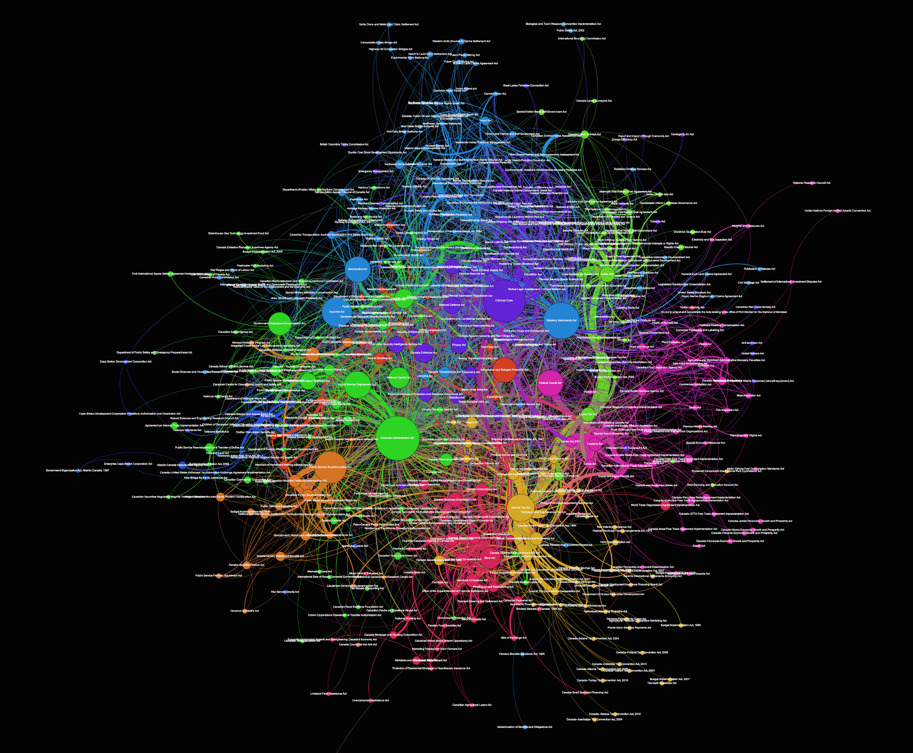

+++
description = "Data visualization and brief analysis of how Canadian legislation connects."
date = "2015-12-08"
lastmod = "2015-12-08"
publishdate = "2015-12-08"
tags = ["networks", "data", "python", "legislation", "visualization"]
title = "Network Graph of Canadian Legislation"
images = ["https://toferc.github.io/posts/cdn_leg_graph/legislation_graph.png"]
+++

# Network Graph of Canadian Legislation

I’ve been talking about doing this one for a while, but had a bit of spare time tonight and finally completed the first cut of a network graph of Canadian legislation and the linkages between the Acts. The raw data for the graph is taken from [Jason White’s](https://twitter.com/actinolite) excellent [Gitlawca](https://github.com/JasonMWhite/gitlawca) repository on GitHub.

A full resolution image is available on my Dropbox account [here](https://www.dropbox.com/s/2r634oppgdtpfy1/gitlawca.png?dl=0).

I used Python, BeautifulSoup and NetworkX to pull down the raw HTML, scrape it for links and pull out the names of legislation. Each instance where a piece of legislation references another Act creates a link between those acts. Where multiple references occur, the weight of the connection is strengthened. All of this is displayed visually through the network graph.
There are 550 Acts and 3782 edges between them.
The sizes of the nodes represent their importance to the network based on their connections and centrality. The width of the edges (connecting links) is determined by the number of links. The colours of the nodes represent communities identified through network analysis algorithms.

The positioning of the nodes within the graph is also important — with the more connected pieces of legislation trending towards the centre.

I haven’t dug into exactly what those communities are yet, but a quick look shows clusters around finance, administration, consumer/border, tax and excise and banking.

On its own, this might have limited interest to folks out there, especially the non-Canadian ones, but future analysis could make it much cooler.

A deeper analysis might give us ideas about what legislation is useful, superfluous, efficient or bloated. A parallel graph of different nations could create some interesting insights about how countries run themselves and prioritize issues. Finally, delving into dynamic graphs that show changes over time could visualize how our laws and countries develop.

I’ll be publishing the code and data on my GitHub soon and would love any of your thoughts or to hear from others who are working on similar projects.

Cheers!

Chris

---

2015–12–08 edit: Noticed a few key missing pieces of legislation like the Criminal Code and extended the net to include them. Re-created the graph with the new nodes.