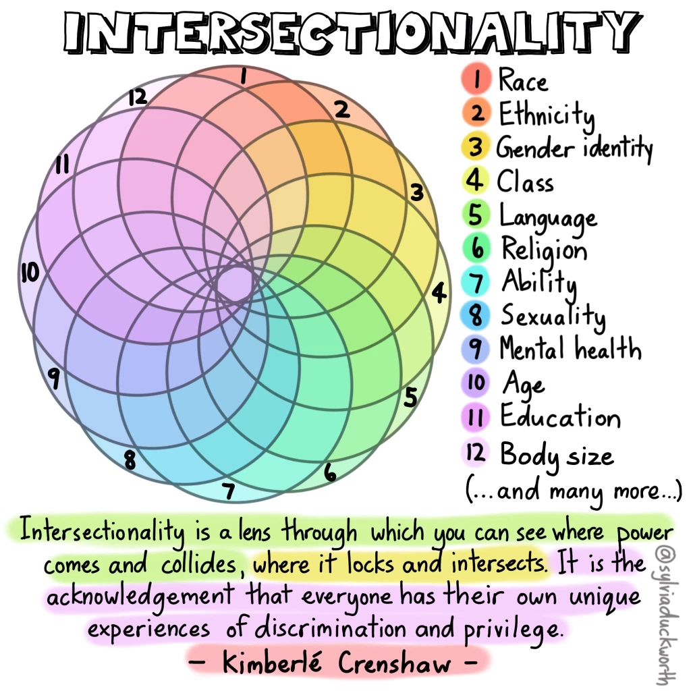

+++
description = "An outline for a model of how we might better understand intersectionality and its impacts in our organizations."
date = "2021-01-11"
lastmod = "2021-01-11"
publishdate = "2021-01-11"
tags = ["intersectionality", "data", "rust", "networks", "data", "bias"]
title = "Intersectional data, racism and bias"
images = ["https://toferc.github.io/posts/intersections_mvp/Untitled 3.png"]
+++

# Intersectional data, racism and bias

### A necessary caveat

As a white, CIS-gendered, Gen X, heterosexual male, my strategy since the spring of 2020 has been to shut the hell up, cede space to, and amplify the voices that matter in addressing racism and bias in our society.

I'm aware of my privilege and hope to use it to celebrate the value in diversity and help others in making our world a more inclusive place. 

I'm offering this blog and the work on the intersectional data project as an attempt to help in this space. I have most certainly made mistakes and failed to consider all the angles in this work. I hope folks will bear with me and correct me when I misstep.

In this blog post, I will outline a model for how we might better understand intersectionality and ways to measure bias in our organizations.

## Table of Contents
* [Anti-Black racism and bias in our organizations](#anti-black-racims-and-bias-in-our-organizations)
* [Identifying anti-Black racism and bias](#identifying-anti-black-racism-and-bias)
* [Intersectionality and data](#intersectionality-and-data)
* [The Intersectional Data MVP](#the-intersectional-data-mvp)
  * [How does it work](#how-does-it-work)
  * [The Questions](#the-questions)
* [The Results](#the-results)
* [Respecting people's data](#respecting-peoples-data)
* [Next Steps](#next-steps)

## Anti-Black racism and bias in our organizations

The issues of systemic racism and specifically anti-Black racism that have come to the forefront in the past year have been a lived reality for large segments of our population for generations.

We have a rhetoric in our society that all people are created equal and have equal opportunities.

Whether we look at policing, government services, education, health care or living conditions, it is clear for anyone who cares to look that this is not the reality. Racism exists in our society and systems. Our systems are designed to protect the interests of the people who built them.

Responding to and changing these systems has become a priority in Canada and beyond. This is easier said than done. A challenge to stopping racism and other forms of bias is that it is extremely hard to prove its existence in concrete ways.

Bias exists in people and behaviors, culture and norms. Bias is part of the medium in which we exist; part of the air that we breathe. These factors aren't changed automatically when a new committee on diversity is formed or a new champion is named. Bias persists and seeps around the edges of conversations and interactions. It manifests in micro-aggressions, exclusion, erasure and expected privilege.

There is no alarm that goes off when someone is excluded from a conversation or opportunity or when someone makes a racist comment. In most situations, a human being who has suffered a thousand other slights is forced to carry one more. And life goes on.

Except it doesn't. Racism and bias has a cost. Within our organizations this cost can include mental health, stress, disempowering, disengaging our people and perpetuating injustice and unearned privilege. Within our [society](https://www.chrc-ccdp.gc.ca/eng/content/statement-anti-black-racism-canada-time-face-truth), the costs can be significantly higher as people are profiled, detained and excluded from services they need and surveilled by the state that should be protecting them. 

A tremendous amount of work must be done to change our systems to truly help those most in need. And that work needs to start inside our institutions.

So that's where we'll start.

---

## Identifying anti-Black racism and bias

Some evidence of this bias in our organizations and systems surfaces in our current surveying practices. We ask questions on discrimination and harassment and ask people to self-identify with labels such as persons with disabilities, members of Black, indigenous, persons of colour (BIPOC) or visible minority communities and women. In return, we get data that we can hypothetically use to identify bias and make changes in our systems.

There are several problems with these surveys.

First, they contribute to the creation of stereotypical buckets and often binary categories.

In completing these surveys, each of us becomes:

- Visible Minority (or not)
- Person with a disability (or not)
- Male, female or other

This practice doesn't represent the complexity of experience that each person brings to the table. It does not explain how different people’s experiences of this part of their lives may differ greatly.

Second, they do not track or infer the impact of what is assumed to be the “norm”. 

Being a white male who is cis-gendered, heterosexual, able-bodied, neuro-typical, university educated and who grew up in a middle-class family is somehow considered normal. 

This identity is the absence of check-boxes. It is not captured except as the baseline through which we measure the different. It is privilege and it is invisible by default.

We can do better.

---

## Intersectionality and data

Intersectionality is a powerful concept to help us understand identity and, through identity, identify the presence of bias.

### Intersectionality (definition)

> *When two or more oppressions overlap in the experiences of an individual or group, creating Interconnected barriers and complex forms of discrimination that can be insidious, covert and compounded.*

> *For example, the barriers and challenges faced by a trans woman of colour who is a refugee claimant will be compounded due to the intersecting vulnerabilities of gender identity, race, immigration status, and socio-economic realities.*

Source: [http://www.the519.org/education-training/glossary](http://www.the519.org/education-training/glossary)

Intersectionality visualization by @SylviaDuckworth

One way that we can make things better is to use intersectionality to better model and understand the impact of overlapping experiences in our existing data. You can find tools and examples in the blog below.

[How to Model Data With Intersectionality](https://towardsdatascience.com/how-to-model-data-with-intersectionality-d42dd45abd7a)

A second way to better understand bias is to change our paradigm of data collection and analysis. To this end, I'd like to share the [intersectional data minimal viable product (MVP)](https://intersectional-data.herokuapp.com/).

---

## The Intersectional Data MVP

This project is an attempt to build a data model and experience to:

- Better model lived experience as it relates to and impacts our work
- Build empathy and compassion for ourselves and others
- Make privilege and inclusiveness visible in our organizations so we can work to balance the scales

The MVP is a data collection tool and a teaching tool. It is designed as a discussion point. It won't be perfect and it won't be correct - but it is a different way of looking at our problems and may point to different solutions that aren't clear at the moment.

---

### **How will this project make things better?**

This MVP is designed to give participants the control to define their lived experience as they perceive it. A single experience is a lens and captures an aspect of personal identity as well as information on impacts and inclusion.

By combining, or layering lenses, we can provide a more holistic understanding of a person’s lived experience in their own words.

By combining lived experiences into a graph that links common concepts like “manager”, “woman”, “black”, “mother”, “father” or “millennial”, we can see how the lenses and experiences interact with each other and develop a better understanding of how our workplaces impact our people.

Wheel of Power/Privilege by @SylviaDuckworth

By identifying intersectional aspects of identity and calling out and making explicit the “normal”, we can identify systemic privilege and bias in our organizations.

The MVP is live now and contains data for demonstration purposes. You can test the app and see how the results 

### How does it work

The Intersectional Data MVP will ask you to answer the same set of questions several times. Each time you will add a lens on your lived experience.

Together, these lenses form a representation of your experience at work.

A completed profile should have five or six lenses, but may contain more.

### **The Questions**

### **1. Name your experience**

How would you describe this lens of your lived experience in your own words?

You are more than just your job. Examples are: Mother, Father, Manager, Artist, Millenial, Black, Indigenous, White, Executive, New Employee. Anything that describes an element of who you are and that impacts your experience in the workplace.

A useful framework for this exercise was developed by Ritu in [Build Your Cultural Lens](https://rituhasin.com/).

### **Some Layers of Cultural Identity**

- Nationality
- Race/Ethnoculture
- Religion
- Gender Identity
- Sexual Orientation

- Dis(Ability)
- Age
- Education
- Socioeconimic Status/Class
- Profession/Career

---

### **2. Is this experience part of you as a person or is it a role related to your work?**

Where does this experience come from? Is it a part of your identity, experience or culture? Is it a role that you have been given as part of your work? Is it a function you play within a network or system?

In shorthand, you can break it down like this:

- Person = part of your individual experience that exists outside of the workplace.
- Role = a formal or informal function or work role within the workplace.

---

### **3. Describe your experience**

Each of us experiences things in different ways. Two managers or two parents may have extremely different perspectives of their lived experience.

To clarify your experience, complete the phrases below in your own words. You will be asked to provide three responses, but you may use as many or as few as you like.

**Though this lens, in the workplace I feel...**

---

### **4. Identify how this experience impacts your work experience.**

How does this experience make you feel included or excluded in the workplace?

For this question, you will move a slider to where you think this experience falls on the range of being more or less included in your workplace.

It generates a score between -1.0 (most excluded) and +1.0 (most included), with 0 being in the middle.

---

### Adding an experience

Adding an experience for "father" looks like this:

Example of adding an experience for "father".

## The Results

By answering these questions several times, you create an intersectional model of your lived experience. The model is in your own words and your experiences are connected to each other and to *similar experiences of other participants*. In the MVP, this is done by simple word matching.

As we add the experience "father", above, we will be connected to every other participant who has the same experience. These experiences are modelled in a network graph. Each experience, like "father" becomes a node. The connections between the nodes show where the experiences occur in the same people. By looking at these connections, we can start to understand who our people are and what they have experienced in a new way.

Here is the graph for "father":

Network graph for the experience "father"

The graph shows the node "father" as well as each other node that was connected to it by a participant. The size of a node shows how often it co-occurs with "father". The colour and shape show whether the experience is personal (green square) or a role from work (blue triangle).

You can also inspect each node. If we inspect father, we see the aggregate data from the experience:

Data from the "father" experience.

Here we can see that the experience "father" is a Personal domain with four instances and an average inclusivity rating of 0.078, which is slightly positive. 

The next chart is a frequency distribution of the responses to the statement: "Though this lens, in the workplace, I feel..."

- **Statement** - the explanation of how the experience effected the person
- **Count** - the number of times people recorded this explanation

### Co-occurrence and intersectionality

We will also see similar data blocks for each other experience that co-occurs with "father".

Here is the example for "executive" as it co-occurs with "father":

Example data for "executive" experience co-occurring with "father".

We see that there are three instances (so far) where "father" co-occurs with "executive". We have the average inclusivity rating for these three occurrences and the statements and frequency distribution. We see that for co-occurrences of "father" and "executive" is slightly positive with an average inclusivity of 0.181.

But what happens when we look at "executive" without the association to "father"?

Selecting the "executive" experience on its own, shows this data:

In this data, we see that there are five total instances of "executive" and that the average inclusivity is 0.088: **lower** than what we saw where executive co-occurred with "father". We can also see that there are new statements, including:

- hardworking
- overwhelmed
- powerful
- stifled
- tired

This is an example of intersectionality. The experience of "executive" is partially shaped by its interaction with other experiences. People with the experience "father" and "executive" tend to feel more included in work than those without.

We can look at the network graph for "executive" to understand some of the other connected experiences:

Example network graph for "executive".

By working with data in a graph format, we can analyze relationships between intersecting experiences. This allows us to identify trends, both positive and negative, in our people's experience and identify and measure potential bias in our organizations. Many additional layers of analytics can also be applied to the data, including:

- advanced network and community analytics
- natural language analytics on statements
- natural language analytics on experience matching
- statistical analysis of intersectionality

## Respecting people's data

One part of this project was thinking about how to respectfully and securely collect, analyse and use very personal data.

The MVP does not collect any identifying information on participants and does not track any cookies or use of the application. Instead, each participant is given a unique code. Only someone with the code can see the unique profile, add to an existing profile or add a new snapshot and link to an existing snapshot.

While the objective of the project is to help organizations identify and address bias, this needs to be based on trust. It is therefore each persons's decision to share or not share their unique code or link their unique profile to an organization.

Note that the MVP currently contains a mixture of demonstration and test data that will be deleted when a formal pilot starts.

## Next steps

The intersectional data MVP is a learning project designed to start a discussion on how we might better model intersectionality in our organizations. [The project is live](https://intersectional-data.herokuapp.com/) using test data, but needs a great deal of work before it is ready for production use inside an organization.

My next steps are actually to seek your feedback on the blog and the prototype and then start a second round of updates so that it better reflects the needs of the community.

Following that, I'll be seeing about 100 participants to test the updated platform and see what the data looks like, what analysis can be done and what insights we can derive. All of this work will be open.

If you're interested in helping, I'd love to hear from you.

You can find the [code on Github here](https://github.com/ToferC/intersections).

I'd welcome any comments, questions, constructive criticism or help on any aspect of this project on Twitter [@ToferC](https://twitter.com/ToferC).
